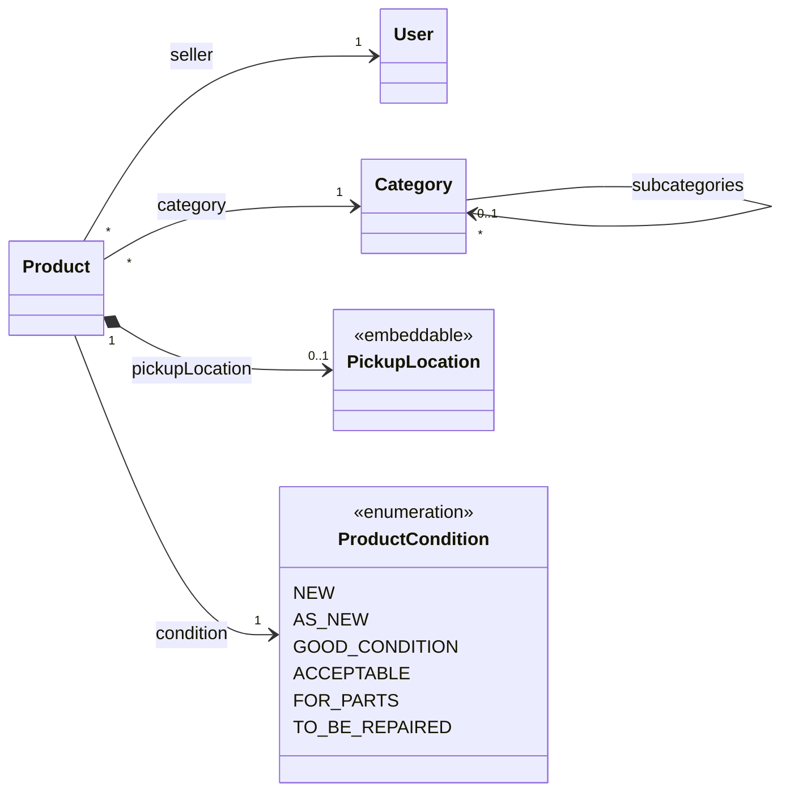

# Domain model

> Conceptual domain structure of the initial version of SegundUM.

## General description

Users publish second-hand products to put them up for sale. Each product is classified into a category from a hierarchy, has a condition and may specify a pickup location when delivery is not available. Categories are managed by an administrator user and are preloaded when the application starts.

## Users and products

- A user publishes products and is recorded as their seller.
- A product is created with an automatic publication date and a view counter set to zero; each time its detail view is opened, the counter is incremented.
- An administrator is a user with extended permissions for category management.

## Categories

- Categories form a hierarchy: each root category may have subcategories, and so on.
- Each category materialises its position in the hierarchy through a path.
- They are loaded from an XML file on application start-up.

## Product condition

A product is always in one of the following conditions:

1. **New**: unused.
2. **As new**: barely used, practically intact.
3. **Good condition**: used but in good condition.
4. **Acceptable**: with evident signs of use.
5. **For parts**: only useful as a source of spare parts.
6. **To be repaired**: needs repair to be functional.

## Pickup location

- It is a value embedded in the product (not a standalone entity): a description of the place plus its coordinates (longitude and latitude).
- It is mandatory when delivery is not available.
- Longitude must be between -180 and 180, and latitude between -90 and 90.

## Model diagram

The following diagram represents the overall structure of the system:

