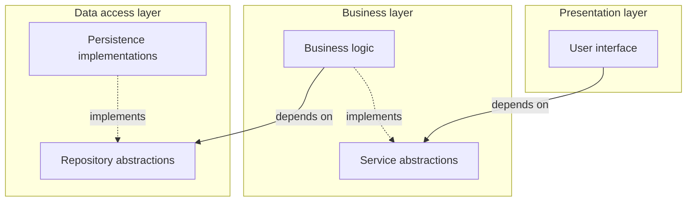

# Design principles

> Patterns and design decisions applied to the initial version of SegundUM.

## Dependency inversion

The layers of the system do not depend on concrete implementations, but on abstractions:

- Services obtain repositories through [`FactoriaRepositorios`](../segundumOlmosMartinez/src/main/java/repositorio/FactoriaRepositorios.java), via their interfaces.
- In turn, web controllers obtain services through [`FactoriaServicios`](../segundumOlmosMartinez/src/main/java/servicio/FactoriaServicios.java).
- The factories resolve implementations via configuration files ([`repositorios.properties`](../segundumOlmosMartinez/src/main/resources/repositorios.properties) and [`servicios.properties`](../segundumOlmosMartinez/src/main/resources/servicios.properties)), so swapping an implementation does not require touching higher-level code.

## Repository and AdHoc Repository patterns

Data access is centralised in the generic [`Repositorio`](../segundumOlmosMartinez/src/main/java/repositorio/Repositorio.java) interface, which defines the CRUD operations common to any entity (`add`, `getById`, `update`, `delete`, `getAll`, `getIds`).

On top of the generic interface, [`RepositorioString`](../segundumOlmosMartinez/src/main/java/repositorio/RepositorioString.java) specialises it by fixing `String` as the identifier type.

The implementation selected by configuration is [`RepositorioJPA`](../segundumOlmosMartinez/src/main/java/repositorio/RepositorioJPA.java): real persistence on EclipseLink/JPA, which serves as the base for the AdHoc variants of each entity.

On that foundation, each entity extends the repository with domain-specific queries (the *AdHoc Repository* pattern):

- [`RepositorioProductosAdHoc`](../segundumOlmosMartinez/src/main/java/umu/aadd/segundum/repositorio/RepositorioProductosAdHoc.java): monthly history and filtered search for products for sale.
- [`RepositorioCategoriasAdHoc`](../segundumOlmosMartinez/src/main/java/umu/aadd/segundum/repositorio/RepositorioCategoriasAdHoc.java): root categories and descendants of a category.
- [`RepositorioUsuariosAdHoc`](../segundumOlmosMartinez/src/main/java/umu/aadd/segundum/repositorio/RepositorioUsuariosAdHoc.java): lookup by email and password.

## Service pattern

Services are defined through interfaces ([`IServicioProductos`](../segundumOlmosMartinez/src/main/java/umu/aadd/segundum/servicio/IServicioProductos.java), [`IServicioCategorias`](../segundumOlmosMartinez/src/main/java/umu/aadd/segundum/servicio/IServicioCategorias.java), [`IServicioUsuarios`](../segundumOlmosMartinez/src/main/java/umu/aadd/segundum/servicio/IServicioUsuarios.java)) obtained via [`FactoriaServicios`](../segundumOlmosMartinez/src/main/java/servicio/FactoriaServicios.java). Each interface has its implementation ([`ServicioProductos`](../segundumOlmosMartinez/src/main/java/umu/aadd/segundum/servicio/ServicioProductos.java), [`ServicioCategorias`](../segundumOlmosMartinez/src/main/java/umu/aadd/segundum/servicio/ServicioCategorias.java), [`ServicioUsuarios`](../segundumOlmosMartinez/src/main/java/umu/aadd/segundum/servicio/ServicioUsuarios.java)), which encapsulates the system's business logic.

Their main responsibilities:

- Orchestrating operations that involve several entities (creating a product requires fetching its category and its seller).
- Centralising business validations in a single place: price greater than or equal to zero, coordinates within range, unique email, nine-digit phone number, administrator permissions for category management.
- Converting model entities into DTOs before exposing them externally.

## DTO pattern

[`ProductoDTO`](../segundumOlmosMartinez/src/main/java/umu/aadd/segundum/dto/ProductoDTO.java) and [`UsuarioDTO`](../segundumOlmosMartinez/src/main/java/umu/aadd/segundum/dto/UsuarioDTO.java) decouple the persistence model from the presentation layer:

- They avoid exposing JPA entities in the web layer, preventing lazy-loading issues and coupling to the database schema.
- They provide views already prepared for the interface: the condition formatted in lower case, the category name or the seller's full name are computed during conversion, not in the views.
