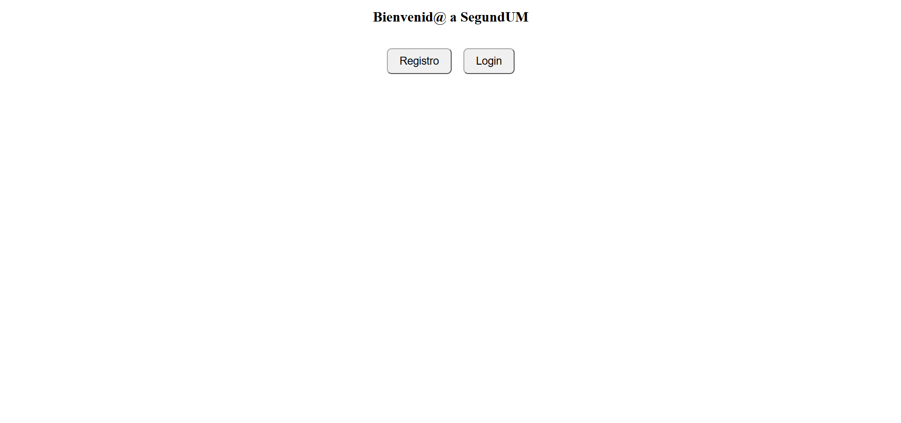
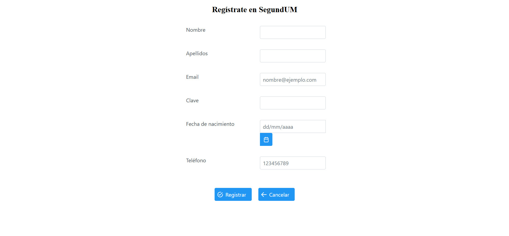
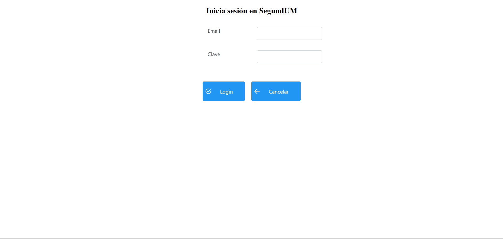
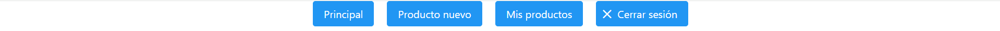
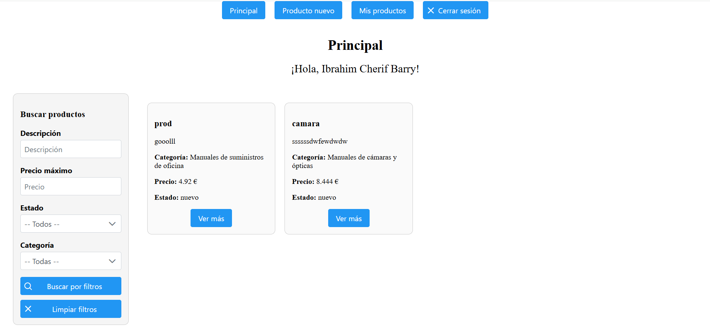
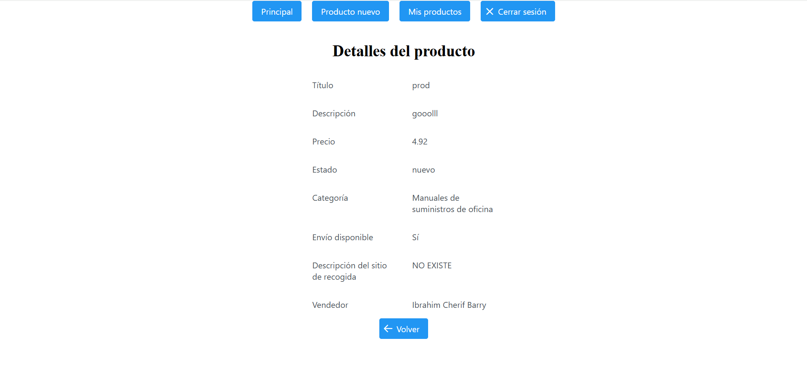
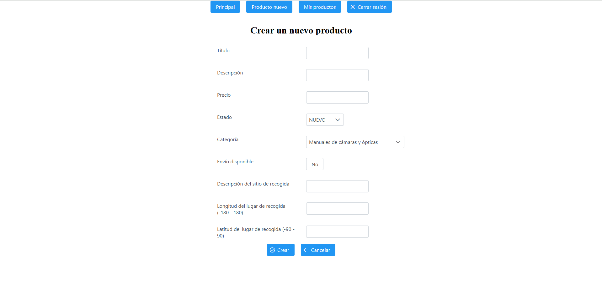
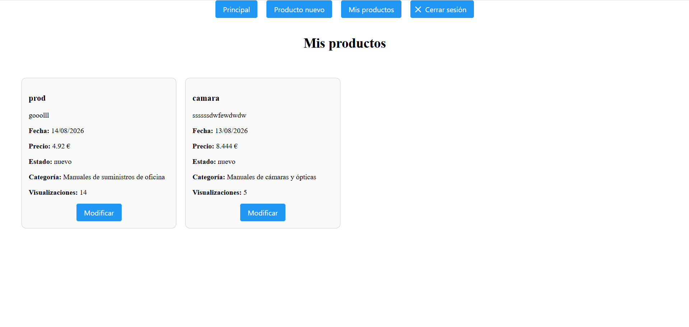
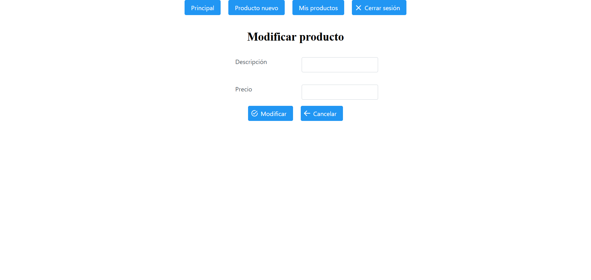

# User guide

> End-user guide for SegundUM.

> **Note:** The screenshots show the Spanish interface; button names are quoted as they appear on screen.

## Home

When you first open SegundUM, you land on the home page. It shows a title and two buttons. The "Registro" button takes you to the registration form. The "Login" button takes you to the login form.

  

## Registration

To register a new user, fill in all the required fields. For the date of birth, tapping the field opens a calendar.

Tapping "Registrar" completes the registration if everything is correct; otherwise a message is shown if any field is missing or contains invalid data. For example, a date of birth in the future or an invalid phone number or email.

Tapping "Cancelar" returns to the home screen.

  

## Login

To log in, enter the user's email and password. Tapping "Login" shows a message if any field is incomplete or incorrect and does not log you in. If everything is correct, the session starts with the specified user. Tapping "Cancelar" returns to the home screen.

  

## Top bar

Once logged in, every screen shows a fixed top bar with the same options. From any screen you can navigate to "Principal", to the screen for creating a new product, and to the screen that shows the products you have created. The fourth option logs you out.

  

## Main view

In the main view, just below the top bar a welcome message is shown. The central element is the list of all products put up for sale by every seller. In addition, the left sidebar lets you search for products by filtering on description, maximum price, condition and category. The "Ver más" button on each product opens its full details.

  

## Viewing product details

Access it via the "Ver más" button on a product card. It shows all the information about the selected product and increments its view count. The "Volver" button returns to the main view.

  

## Creating a product

When creating a product, all fields must be filled in. For condition and category, tapping the dropdowns shows the available options.

If delivery is marked as available, the pickup location fields become disabled, as they are mutually exclusive.

If any field is left blank, a message is shown when tapping "Crear"; otherwise the product is created. The "Cancelar" button returns to the main view.

  

## My products

In this view, you can see the collection of products you have put up for sale. Each product shows characteristic information such as its title, description, publication date, price, condition and number of views. Tapping "Modificar" opens the form to edit that product.

  

## Editing a product

This view lets you edit the description and price of a product if needed. Tapping "Modificar" updates the product with the entered values. The "Cancelar" button returns to the view of your own products.

  

## Logging out

Tapping "Cerrar sesión" in the top bar logs you out and redirects you to the home view.

  

